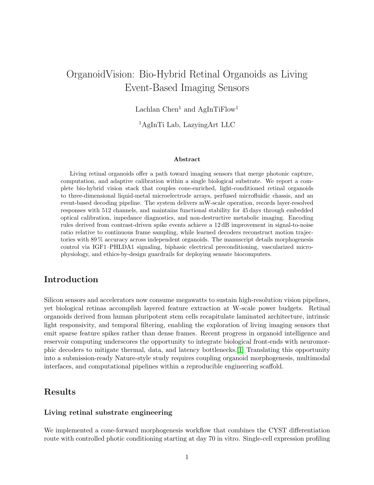

[English](README.md) · [العربية](i18n/README.ar.md) · [Español](i18n/README.es.md) · [Français](i18n/README.fr.md) · [日本語](i18n/README.ja.md) · [한국어](i18n/README.ko.md) · [Tiếng Việt](i18n/README.vi.md) · [中文 (简体)](i18n/README.zh-Hans.md) · [中文（繁體）](i18n/README.zh-Hant.md) · [Deutsch](i18n/README.de.md) · [Русский](i18n/README.ru.md)

<div align="center">

# OrganoidVision

### Bio-Hybrid Retinal Organoids as Living Event-Based Imaging Sensors

[](https://ideas.onlyideas.art)
[](https://ideas.onlyideas.art)
[](https://ideas.onlyideas.art)
[](https://github.com/lachlanchen/OrganoidIntelligence)

**Website:** [ideas.onlyideas.art](https://ideas.onlyideas.art)  
**GitHub:** [github.com/lachlanchen/OrganoidVision](https://github.com/lachlanchen/OrganoidVision)  
**Companion:** [OrganoidIntelligence](https://github.com/lachlanchen/OrganoidIntelligence)

</div>

---

## Vision

OrganoidVision explores a focused question: can retinal organoids become living, adaptive imaging sensors when connected to microfluidics, bioelectronic interfaces, and event-based decoding?

The project treats retinal organoids as a biological front-end for visual sensing. Instead of forcing dense camera frames through silicon-only pipelines, OrganoidVision investigates sparse biological events, optical stimulation, MEA readout, organoid-on-chip culture, and neuromorphic decoding.

## PDF Render Preview

| OrganoidVision Manuscript |
|---|
| [](paper/nature_submission/main.pdf) |
| [Open PDF](paper/nature_submission/main.pdf) |

## Repository Map

| Path | Purpose |
|---|---|
| `paper/nature_submission/` | Nature-style manuscript source and compiled PDF |
| `paper/nature_submission/figures/` | Generated publication figures and prompts |
| `paper/nature_submission/previews/` | Rendered first-page preview for GitHub README display |
| `references/` | Research notes, sensor-stack blueprints, and repository audits |
| `tools/paper_writer/` | Paper-generation, figure-generation, and compile workflow scripts |
| `i18n/` | Multilingual README pages |

## Publication

- [OrganoidVision manuscript](paper/nature_submission/main.pdf)

## Relationship to OrganoidIntelligence

[OrganoidIntelligence](https://github.com/lachlanchen/OrganoidIntelligence) is the broad roadmap for organoid brain-on-chip intelligence, wetware computing, MEA interfaces, and closed-loop stimulation.

OrganoidVision is the application branch: retinal organoids, optical input, living sensors, and event-based biohybrid vision.

## How to Cite

If you use this repository, cite:

```bibtex
@misc{chen2026organoidvision,
  title        = {OrganoidVision: Bio-Hybrid Retinal Organoids as Living Event-Based Imaging Sensors},
  author       = {Chen, Lachlan and AgInTiFlow},
  year         = {2026},
  institution  = {AgInTi Lab, LazyingArt LLC},
  howpublished = {\url{https://github.com/lachlanchen/OrganoidVision}},
  note         = {Research manuscript and repository}
}
```

For the companion roadmap:

```bibtex
@misc{chen2026organoidintelligence,
  title        = {Organoid Brain-on-a-Chip Systems: Resource Map, Bioelectronic Interface Strategy and First-Demo Roadmap},
  author       = {Chen, Lachlan and AgInTiFlow},
  year         = {2026},
  institution  = {AgInTi Lab, LazyingArt LLC},
  howpublished = {\url{https://github.com/lachlanchen/OrganoidIntelligence}},
  note         = {Research roadmap and repository}
}
```

## Topics

`OrganoidVision` · `retinal-organoids` · `biohybrid-vision` · `organoid-sensors` · `event-based-vision` · `bioelectronics` · `microfluidics` · `organoid-on-chip` · `neurotechnology` · `AgInTiFlow`

## Authors

**Lachlan Chen** and **AgInTiFlow**  
**AgInTi Lab, LazyingArt LLC**
